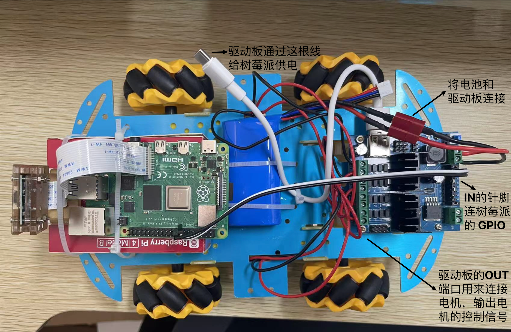
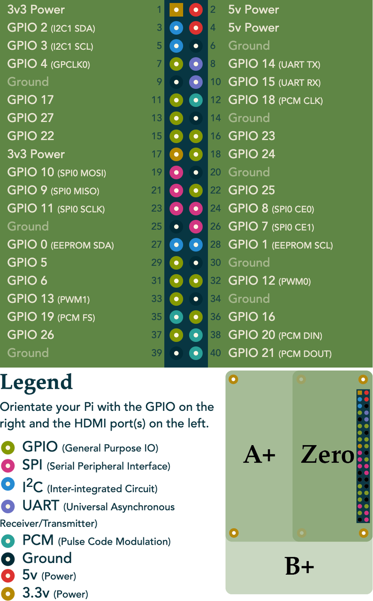

# Hardware

This section gives the bill of materials, the overall architecture and steps of assembling.

## 1. Embodied AI Car Hardware Bill of Materials

| Component | Specification / Model | Reference Link |
| :--- | :--- | :--- |
| **Control & Storage** | | |
| Raspberry Pi 4B | 4GB RAM or higher recommended | *Search on major e-commerce platforms* |
| TF Card | 64GB / 128GB High-Speed Card | [【Taobao】SanDisk High-Speed Memory Card](https://e.tb.cn/h.TvMEv9kHf2NeplL?tk=WSp5elhV5Sn) |
| Card Reader | Choose USB or Type-C based on your computer | [【Taobao】Ugreen All-in-One Card Reader](https://e.tb.cn/h.Tvt9k27nXGzZvIq?tk=PAJfelhUVEu) |
| **Chassis & Drivetrain** | | |
| Chassis Kit | Mecanum wheel chassis + 4 motors | [【Taobao】Mecanum Wheel Car Kit](https://e.tb.cn/h.TvMl7ODcXvR3gBa?tk=g2lKel6ximg) |
| Motor Driver | Quad-channel L298N Motor Driver Module | [【Taobao】L298N Quad Motor Driver Module](https://e.tb.cn/h.TvtWvqZbhsTVhOM?tk=Qlqbel6xlOS) |
| **Vision Module** | | |
| Camera | 5MP CSI Interface Camera + Mount | [【Taobao】Raspberry Pi CSI Camera](https://e.tb.cn/h.TEZ0tPxNHYR8bVS?tk=oL31el6BNC9) |
| **Power System** | | |
| Battery | 7.4V 18650 Li-ion Battery Pack (T-plug) | [【Taobao】7.4V RC Car Li-ion Battery](https://e.tb.cn/h.Tvt4ea8vvDTi8sU?tk=55hzel6z98T) |
| Battery Cable | T-plug to XT60 Male | [【Taobao】T-plug with Wire to XT60 Male](https://e.tb.cn/h.TEZaZCaTaPhIdCF?tk=GEQMel6BqGm) |
| **Wires & Tools** | | |
| Dupont Wires | Female-to-Female | [【Taobao】Pure Copper Dupont Wires](https://e.tb.cn/h.TEazvARy4dVynFs?tk=PC20el6xsSu) |
| Wires | RV0.5 standard pure copper multi-strand wire | [【Taobao】RV Single-Core Multi-Strand Soft Wire](https://e.tb.cn/h.TvMkqBU1v2bIL8R?tk=urmZel6v86n) |
| Screwdriver | PH0 Phillips Head (for M2.5, M3 screws) | [【Taobao】Deli PH0 Phillips Screwdriver](https://e.tb.cn/h.TvPxrsTTwQoVKTu?tk=fmCQel6NVPN) |
| Wire Stripper | Deli 6-inch multi-function stripper (0.6-2.6mm) | [【JD.com】Deli Multi-function Wire Stripper](https://3.cn/2dkT0I-5) |

## 2. Overall architecture of the Embodied AI car

## 3. Steps of Assembling

---

#### 3.1 Mount Components & Connect Motors to Driver Board

1.  **Mount the Driver Board:** Securely fasten the motor driver board to the car chassis.
    -   **CRITICAL WARNING:** The chassis is metal. To prevent short circuits that can damage your electronics, **DO NOT** let the solder points on the back of the driver board or Raspberry Pi touch the metal chassis directly. Use standoffs, an insulation pad, or another non-conductive method to mount them.
2.  **Prepare Wires:** For each of the 4 motors, prepare one red and one black wire. Strip 2-3mm of insulation from both ends of each wire.
3.  **Connect Wires to Motors:** Attach one red and one black wire to the metal tabs of each motor. Ensure the connection is secure (soldering is recommended).
4.  **Connect Motors to Driver Board:**
    -   Route the wires from the first motor through the chassis.
    -   Connect the wires to the `OUT1` and `OUT2` screw terminals on the driver board. Loosen the terminal screw, insert the wire, and tighten firmly.
    -   Repeat for the other 3 motors, connecting them to `OUT3`/`OUT4`, `OUT5`/`OUT6`, and `OUT7`/`OUT8` respectively.

---

#### 3.2 Connect Battery to Driver Board

1.  **Secure the Battery:** Fasten the battery securely onto the chassis using zip ties, tape, or another reliable method.
2.  **Ensure Power is Off:** Double-check that the power switch on the driver board is in the **OFF** position.
3.  **Connect Power Cable:**
    -   **CRITICAL WARNING:** During this process, never let the positive and negative terminals of the battery touch each other. If you notice any abnormal heat, smoke, or sparks, disconnect the battery immediately.
    -   Take the provided power cable (with T-plug connector) and connect it to the battery, matching red to red and black to black. **Do not reverse the polarity.**
    -   Connect the other end of the **black wire** to the `GND` terminal on the driver board.
    -   Connect the other end of the **red wire** to the `VCC` (or `+12V`) terminal on the driver board. **Triple-check these connections before proceeding.**

---

#### 3.3 Connect Driver Board to Raspberry Pi

1.  **Mount the Raspberry Pi:** Securely fasten the Raspberry Pi to the chassis, following the same short-circuit warning as in step 1.
2.  **Power the Raspberry Pi from the Driver Board:**
    -   Ensure the driver board's power switch is still **OFF**.
    -   Use a USB-A to USB-C cable to connect the driver board's USB-A port to the Raspberry Pi's USB-C power port.
    -   You can now flip the power switch ON to test if the Raspberry Pi boots up correctly. Power it OFF again before the next step.
3.  **Connect GPIO Control Pins:**
    -   Using female-to-female Dupont wires, connect the GPIO pins on the Raspberry Pi to the control pins `IN1` through `IN8` on the driver board.
    -   The specific GPIO pins you use on the Raspberry Pi must match the pin definitions in your control code. Refer to your code and a Raspberry Pi pinout diagram.

